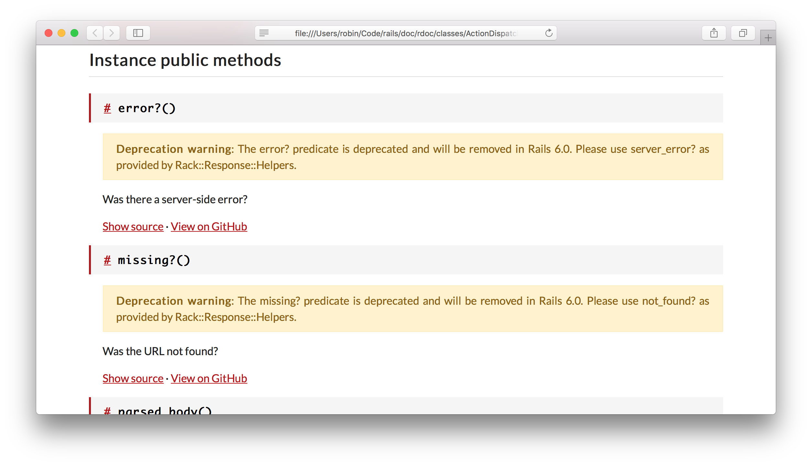
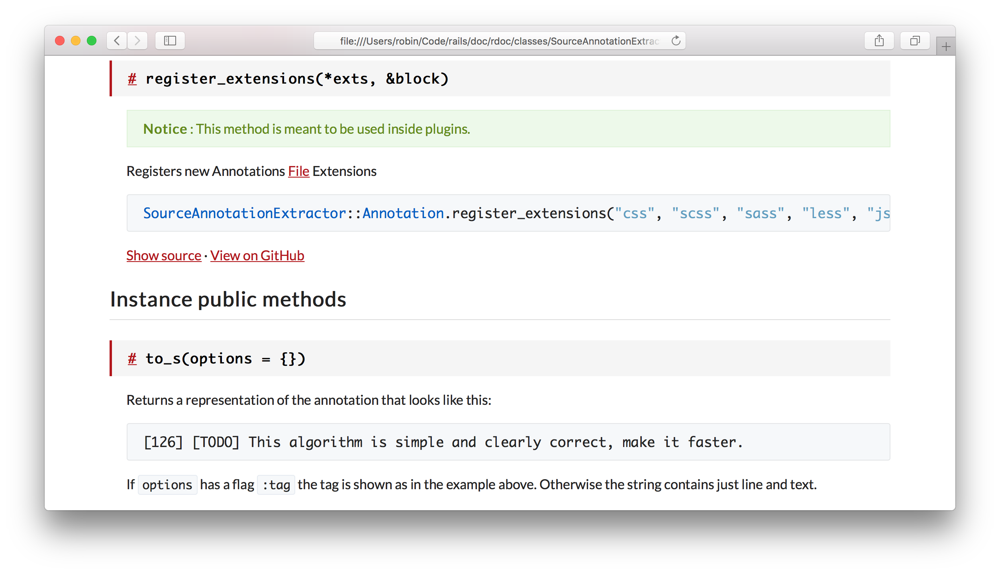
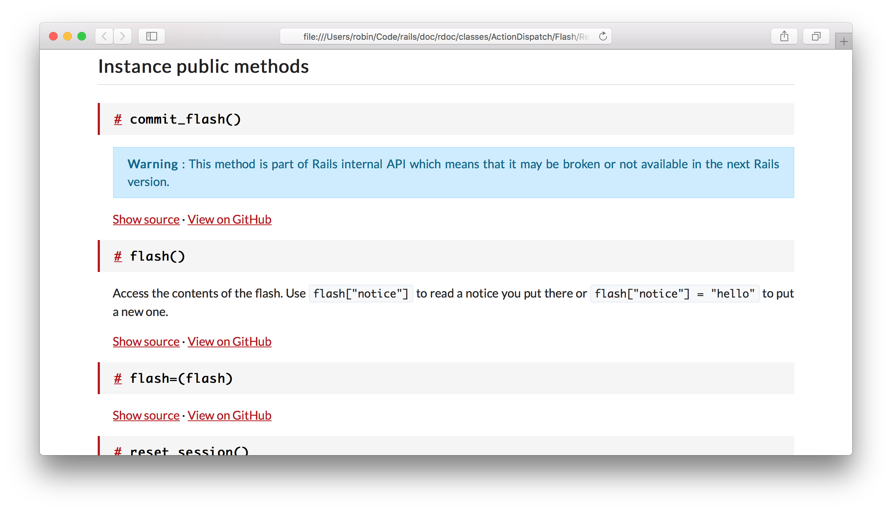

# TDoc - An RDoc-based generator

TDoc is a totally reworked version of [SDoc](https://github.com/zzak/sdoc).
This project can eventually be merged with SDoc but it is here to bring a
discussion around our documentation tool and to test some features before
integrating / validating them.

What's new compared to SDoc:

* HTML5/CSS3 mark-up
* No dependency on jQuery and modern JavaScript
* No dependency on Highlight.js
* Warning attached to deprecated methods
* The `:plugin:` and `:private:` directives are supported
* The `:sig:` directive is supported
* Version picker
* Versionned URLs
* A color scheme with a closer feeling with the Rails guides one
* Hopefully, the code base is more friendly to people which aren't familiar
  with RDoc internals

What's missing compared to SDoc:

* The sidebar with all the classes has been removed
* The listing of Ruby files which include definition of the class / module and
  thus the generation of HTML files for Ruby files have been removed
* The `< Object` part for PORO definitions has been nixed

## Warning attached to deprecated methods

TDoc is able to automatically infer deprecated methods by analyzing the content
of these methods. If any call to `ActiveSupport::Deprecation.warn` is present,
the message passed to this method is extracted and displayed as a warning.
For example:

## The `:plugin:` and `:private:` directives

Like the `:nodoc:` directive, `:plugin:` and `:private:` can be used to specify
the API scope of a method. A warning is displayed as well on these method's
description:

    def register_extensions # :plugin:

    def view_renderer # :private:

## The `:sig:` directive

The `:sig:` directive can be used to specify the type signature of a method.
It automatically injects the types in the method final signature. For example:

    # :sig: String|Symbol, Object -> Object
    def []=(key, value)

Will produce:

    []=(String|Symbol key, Object value) -> Object

However, if `:call-seq:` is used, you should rather specify the types there ;
`:sig:` is ignored whenever the former is used.

## Version picker

It's possible to "version" the generated output by specifying the version the
documentation is currently generated for.

    RDoc::Task.new do |t|
      t.version = '1.2.3'
    end

A version picker can also be displayed. Its behavior is based on the presence of
a  `versions.json` file at the root of the server ; this file must contain all
the versions that are available through the site in the JSON format.

This file can be generated with the following Rake task:

    # To generate a `versions.json` with all the non-prereleased
    # versions of the current gem (based on the gemspec file
    # present near the Rakefile) published on RubyGems.
    TDoc::VersionsTask.new

    # To generate a `versions.json` with all the non-prereleased
    # versions of the current gem apart from any version before 4.0.0.
    TDoc::VersionsTask.new('4.0.0')

## Versionned URLs

In combination with the ability to specify the project's version, it's possible
to automatically ask TDoc to attach a version to your host's URL.

    RDoc::Task.new do |t|
      t.version = 'v1.2.3'
      t.host    = 'doc.myproject.org'
    end

Then, any link pointing to `doc.myproject.org/any/file.html`, will be replaced
with a link to `doc.myproject.org/v1.2.3/any/file.html`.

**Note**: The `version` option should be specified for this option to work.

## Future work / room for improvements

* Use Sass to write the stylesheets.
* Use a minifier for assets and fingerprinting. Fingerprinting would only be
  important because the root of the API server changes whenever a new version
  is released.
* Improve the search by being a bit more clever (like a search that begins with `#`
  would only look for methods and typing a full name like `ActiveRecord::Base`
  should give this class as the first result).
* Strip out HTML tags from the JSON index. This would lessen the file size and
  thus make page load faster and we could remove the `stripHTML` function from
  the main JavaScript file.
* Add an "Edge" badge for edge documentation.
* Allow other people to use this generator:
    - Ability to change the colors
    - Ability to change the logo
    - Ability to change the
* Make the RDoc Markdown parser understands fenced code blocks and PHP Markdown
  tables.

## License

This project is released under the MIT license. See the `LICENSE` file for further information.
